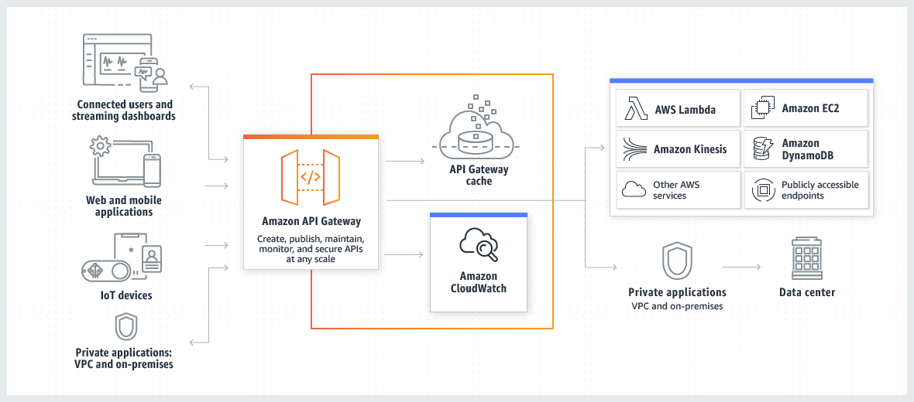

# API Gateway
## Concepts

Amazon API Gateway is an AWS service for creating, publishing, maintaining, monitoring, and securing REST, HTTP, and WebSocket APIs at any scale. API developers can create APIs that access AWS or other web services, as well as data stored in the AWS Cloud. As an API Gateway API developer, you can create APIs for use in your own client applications. Or you can make your APIs available to third-party app developers.

## Cross-origin resource sharing (CORS)

Cross-origin resource sharing (CORS) is a browser security feature that restricts HTTP requests that are initiated from scripts running in the browser.

***CORS is enforced by the Client.***

CORS is typically required to build web applications that access APIs hosted on a different domain or origin. You can enable CORS to allow requests to your API from a web application hosted on a different domain. For example, if your API is hosted on https://{api_id}.execute-api.{region}.amazonaws.com/ and you want to call your API from a web application hosted on example.com, your **API must support CORS**.

If you configure CORS for an API, API Gateway automatically sends a response to preflight OPTIONS requests, even if there isn't an OPTIONS route configured for your API. For a CORS request, **API Gateway adds the configured CORS headers to the response from an integration**.

**If you configure CORS for an API, API Gateway ignores CORS headers returned from your backend integration.**

## Exam Tips
* CORS is configured at the API gateway to define which sites can hold calls for API Gateway. Browsers use OPTIONS call to check-it.
* If you got an error like ***"Origin policy cannot read at remote resource"*** you need to enable CORS on API Gateway.
* **CORS** is only supported for **HTTP APIs**.
* API Gateway **supports Cache**, so **common requests** responses can be **reducing the response latency**.
* API Gateway is low cost and **scales automatically**.
* You can log results to CloudWatch.
* You can **throttle** API Gateway to **prevent attacks** as well as integrated it with AWS WAF.
* If you use JavaScript or AJAX (**code running on browser**) that use **multiple domains** with API Gateway, remember to **enable CORS**.