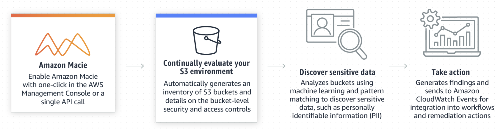

# AWS Macie

## Concepts

Amazon Macie is a security service that uses machine learning to automatically discover, classify, and protect sensitive data in AWS. Amazon Macie recognizes sensitive data such as personally identifiable information (PII) or intellectual property, and provides you with dashboards and alerts that give visibility into how this data is being accessed or moved.

## Essential Tips
* Amazon Macie uses machine learning and pattern matching to cost efficiently discover sensitive data at scale.
* Macie automatically detects a large and growing list of sensitive data types, including personal identifiable information (PII) such as names, addresses, and credit card numbers.
* Gives you constant visibility of the data security and data privacy of your data stored in Amazon S3.

## References and complementary readings
* [Amazon Macie](https://aws.amazon.com/macie/)
