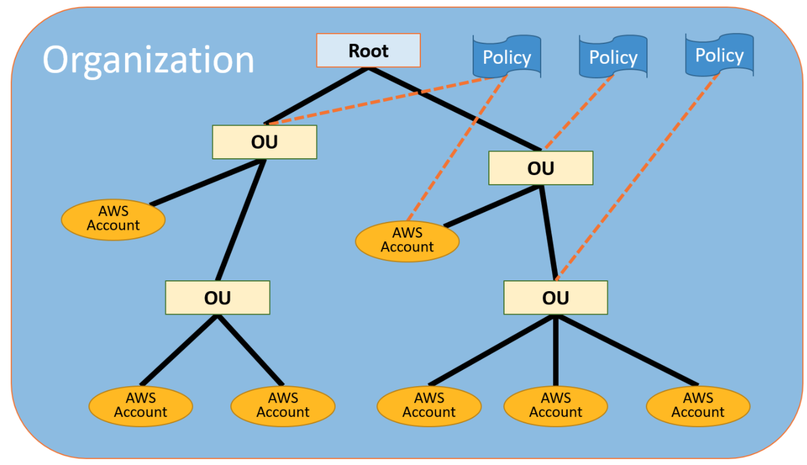

# AWS Organization

AWS Organizations is an account management service that enables you to consolidate multiple AWS accounts into an organization that you create and centrally manage. AWS Organizations includes account management and consolidated billing capabilities that enable you to better meet the budgetary, security, and compliance needs of your business. As an administrator of an organization, you can create accounts in your organization and invite existing accounts to join the organization.

## Concepts
* **Organization**: Entity that consolidates yours AWS accounts so that you can administer them as a single unit. You can use the AWS Organizations console to centrally view and manage all of your accounts within your organization. An organization has one master account along with zero or more member accounts. You can organize the accounts in a hierarchical, tree-like structure with a root at the top and organizational units nested under the root. Each account can be directly in the root, or placed in one of the OUs in the hierarchy. An organization has the functionality that is determined by the feature set that you enable.
* **Root**: The parent container for all the accounts for your organization. If you apply a policy to the root, it applies to all organizational units (OUs) and accounts in the organization.
* **Organization unit (OU)**: A container for accounts within a root. An OU also can contain other OUs, enabling you to create a hierarchy that resembles an upside-down tree, with a root at the top and branches of OUs that reach down, ending in accounts that are the leaves of the tree. When you attach a policy to one of the nodes in the hierarchy, it flows down and affects all the branches (OUs) and leaves (accounts) beneath it. An OU can have exactly one parent, and currently each account can be a member of exactly one OU.
* **Account**: A standard AWS account that contains your AWS resources. You can attach a policy to an account to apply controls to only that one account. There are two types of accounts in an organization: 
  * master account: create and remove accounts, invite other existent accounts. Applies policies to entities (accounts, OUs or root).
  * member accounts: can only belong to one organization at a time. 
* Service control policies (SCPs) are a type of organization policy that you can use to manage permissions in your organization. SCPs offer central control over the maximum available permissions for all accounts in your organization.

## Essential Tips

### Best practices on AWS Organization
* Always use MFA on root account.
* Always use strong and complex password for root account
* Paying accounts should be used for billing purpose only. Do not deploy resources into billing account.
* Enable/Disable AWS services using Service Control Policies (SCP)on OUs or individual accounts. 

## Labs about
* TODO

## References and complementary readings
* [AWS Organization User Guide](https://docs.aws.amazon.com/organizations/latest/userguide/orgs_introduction.html)
