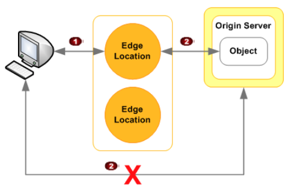

# CloudFront

Amazon CloudFront is a web service that speeds up distribution of your static and dynamic web content, such as .html, .css, .js, and image files, to your users. CloudFront delivers your content through a worldwide network of data centers called edge locations. When a user requests content that you're serving with CloudFront, the user is routed to the edge location that provides the lowest latency (time delay), so that content is delivered with the best possible performance.

## Concepts
* **CDN**: Content Distribution Network
* **Edge Locations**:These are the locations where the content will be cached. Is separate to an AWS Region/AZ.
* **Origin servers**: An Amazon S3 bucket, a load-balancer or your own HTTP server, from which CloudFront gets your files which will then be distributed from CloudFront edge locations all over the world.
* **Distribution**: Name given to the CDN which consist of a collection of edge locations.
* **Object Access Identity**: CloudFront account who access the S3 Content. Used to filter access.

## Essential Tips
* Support two type of content:
  * Web distribution, for web site caching
  * RTMP distribution, for media streaming
  * Objects has TTL
  * You can invalidate (clear cached objects), but you will be charged.
  * Invalidations can be created using path expressions.

### Content filtering
* Signed URL allows you to restrict access to content so only specific used can view that content. Signed URLs works for files. 1 file = 1 URL.
* A signed cookie allows you to access multiple files.
* Signed URLs or signed cookies have policies attached. Policies can include:
  * URL expiration
  * IP Ranges
  * Trusted Signers (which AWS accounts can create signed URLs)

### Restrict Access in CloudFront
* You can restrict access at CloudFront Edge (1) or in Origin access (2)
* S3 policies can limit access for OAI identity.

* 

## Labs about
*

## References and complementary readings

