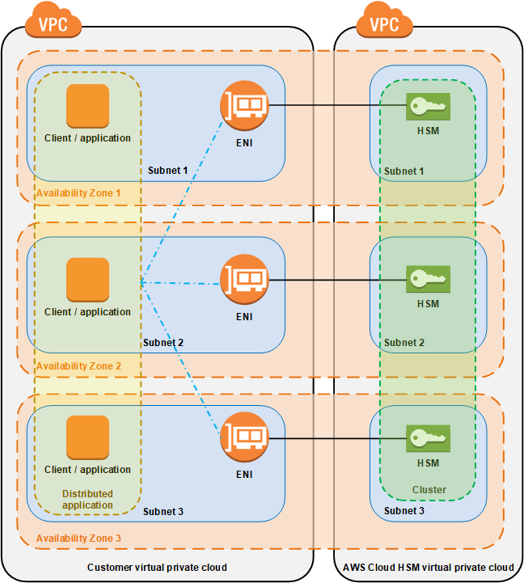

# Cloud HSM

## Concepts

AWS CloudHSM provides hardware security modules in the AWS Cloud. A hardware security module (HSM) is a computing device that processes cryptographic operations and provides secure storage for cryptographic keys.

When you use an HSM from AWS CloudHSM, you can perform a variety of cryptographic tasks:
* Generate, store, import, export, and manage cryptographic keys, including symmetric keys and asymmetric key pairs.
* Use symmetric and asymmetric algorithms to encrypt and decrypt data.
* Use cryptographic hash functions to compute message digests and hash-based message authentication codes (HMACs).
* Cryptographically sign data (including code signing) and verify signatures.
* Generate cryptographically secure random data.

### Clusters

AWS CloudHSM provides hardware security modules (HSMs) in a cluster. **A cluster is a collection of individual HSMs that AWS CloudHSM keeps in sync.** You can think of a cluster as one logical HSM. When you perform a task or operation on one HSM in a cluster, the other HSMs in that cluster are automatically kept up to date.

You can create a cluster that has from 1 to 28 HSMs (the default limit is 6 HSMs per AWS account per AWS Region). You can place the HSMs in different Availability Zones in an AWS Region. **Adding more HSMs to a cluster provides higher performance. Spreading clusters across Availability Zones provides redundancy and high availability.**

## Exam Tips
* **Dedicated** hardware security modules (HSM)
* Supports **FIPS140-2 Level 3**. It's the only service in AWS that support this level.
* **Runs within a VPC** in your account. Project ENI in your VPC to be accesible.
* **Single tenant, dedicated hardware, multi AZ cluster**.
* Industry standard API, **no AWS API**.
* **CloudHSM are irretrievable if lost.**
* Preferred answer for **Regulatory compliance requirements**.