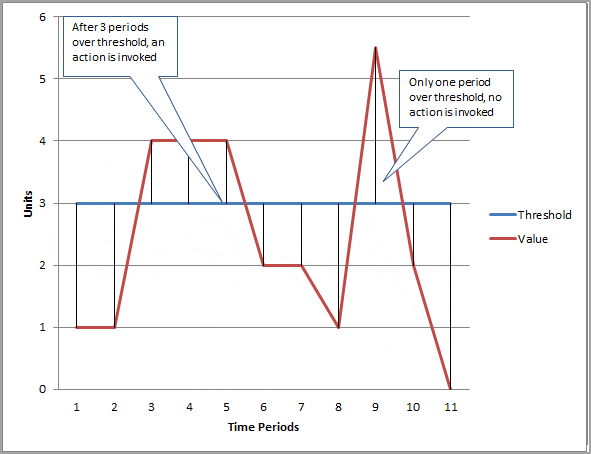

# CloudWatch

## Concepts

Amazon CloudWatch monitors your Amazon Web Services (AWS) resources and the applications you run on AWS in real time. You can use CloudWatch to collect and track metrics, which are variables you can measure for your resources and applications.
You can create alarms that watch metrics and send notifications or automatically make changes to the resources you are monitoring when a threshold is breached. 

Metrics are **stored separately in Regions**, but you can use CloudWatch cross-Region functionality to aggregate statistics from different Regions.

The following terminology and concepts are central to your understanding and use of Amazon CloudWatch:
* **Namespaces**: is a ***container*** for CloudWatch metrics. Metrics in different namespaces are isolated from each other, so that metrics from different applications are not mistakenly aggregated into the same statistics.
* **Metrics**: represents a time-ordered set of data points that are published to CloudWatch. Metrics are **uniquely defined by a name, a namespace, and zero or more dimensions**. Metrics can have different resolutions:
  * Standard Resolution: one-minute granularity
  * High Resolution: one second granularity
* **Dimensions**: is a ***name/value pair*** that is part of the identity of a metric. You can assign ***up to 10 dimensions to a metric***.
* **Statistics**: metric ***data aggregations*** over specified periods of time. Aggregations are made using the namespace, metric name, dimensions, and the data point unit of measure, within the time period you specify. Following are the supported statistics:
  * Minimum
  * Maximum
  * Sum
  * Average
  * SampleCount: The count (number) of data points used for the statistical calculation.
  * pNN.NN: The value of the specified percentile. You can specify any percentile, using up to two decimal places (for example, p95.45). Percentile statistics are not available for metrics that include any negative values.
* **Percentiles**: indicates the relative standing of a value in a dataset. Percentiles help you get a better understanding of the distribution of your metric data. Percentiles are often ***used to isolate anomalies.***
* **Alarms**: You can use an alarm to automatically ***initiate actions*** on your behalf. An alarm watches a single metric over a specified time period, and performs one or more specified actions, based on the value of the metric relative to a threshold over time. 

### Metrics Retention

CloudWatch retains metric data as follows:
* Data points with a period of less than 60 seconds are available for 3 hours. These data points are high-resolution custom metrics.
* Data points with a period of 60 seconds (1 minute) are available for 15 days
* Data points with a period of 300 seconds (5 minute) are available for 63 days
* Data points with a period of 3600 seconds (1 hour) are available for 455 days (15 months)

### CloudWatch Alarms

You can create both metric alarms and composite alarms in CloudWatch.
* A **metric alarm** watches a single CloudWatch metric or the result of a math expression **based on CloudWatch metrics**. The alarm performs one or more actions based on the value of the metric or expression relative to a threshold over a number of time periods. The action can be sending a notification to an Amazon SNS topic, performing an Amazon EC2 action or an Auto Scaling action, or creating a Systems Manager OpsItem.
* A **composite alarm** includes a **rule expression that takes into account the alarm states of other alarms** that you have created. The composite alarm goes into ALARM state only if all conditions of the rule are met. The alarms specified in a composite alarm's rule expression can include metric alarms and other composite alarms.
Using composite alarms can reduce alarm noise. You can create multiple metric alarms, and also create a composite alarm and set up alerts only for the composite alarm. For example, a composite might go into ALARM state only when all of the underlying metric alarms are in ALARM state.
Composite alarms can send Amazon SNS notifications when they change state, and can create Systems Manager OpsItems when they go into ALARM state, but **can't perform EC2 actions **or Auto Scaling actions.

A metric alarm has the following possible states:
* **OK** – The metric or expression is within the defined threshold.
* **ALARM** – The metric or expression is outside of the defined threshold.
* **INSUFFICIENT_DATA** – The alarm has just started, the metric is not available, or not enough data is available for the metric to determine the alarm state.

When you create an alarm, you specify three settings to enable CloudWatch to evaluate when to change the alarm state:
* **Period** is the length of time to evaluate the metric or expression to **create each individual data point for an alarm**. It is expressed in seconds. If you choose one minute as the period, the alarm evaluates the metric once per minute.
* **Evaluation Periods** is the **number of the most recent periods**, or data points, **to evaluate when determining alarm state**.
* **Datapoints to Alarm** is the **number of data points within the Evaluation Periods** that must be breaching to **cause the alarm to go to the ALARM state**. The breaching data points don't have to be consecutive, they just must all be within the last number of data points equal to Evaluation Period.

### Alarms actions
* Notifications using SNS Topics
* Autoscaling actions on simple or step scaling groups
* EC2 actions like stop, terminate or reboot.
* System Manager SysOps Center

## Exam-Tips
* CloudWatch is used for performance
* Default CloudWatch resolution is 5 minutes
* Detailed monitoring resolution is 1 minute
* Minimal resolution is one second (retention 3 hours), maximal retention is 15 months (1 hour resolution)

