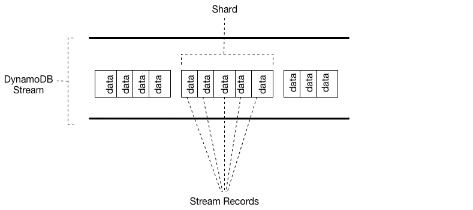

# DynamoDB
## Concepts

Amazon DynamoDB is a **fully managed NoSQL database** service that provides fast and predictable performance with seamless scalability. DynamoDB lets you offload the administrative burdens of operating and scaling a distributed database so that you don't have to worry about hardware provisioning, setup and configuration, replication, software patching, or cluster scaling. DynamoDB also offers encryption at rest, which eliminates the operational burden and complexity involved in protecting sensitive data.

You can scale up or scale down your tables' throughput capacity **without downtime or performance degradation**.

DynamoDB provides **on-demand backup capability**. It allows you to create full backups of your tables for long-term retention and archival for regulatory compliance needs. You can create **on-demand backups and enable point-in-time recovery** for your Amazon DynamoDB tables. Point-in-time recovery helps protect your tables from accidental write or delete operations.

DynamoDB allows you to **delete expired items** from tables automatically to help you r**educe storage usage and the cost of storing data** that is no longer relevant. 

**DynamoDB automatically spreads** the data and traffic for your tables over a sufficient number of servers to handle your throughput and storage requirements, while **maintaining consistent and fast performance**. All of your data is stored on solid-state disks (SSDs) and is **automatically replicated across multiple Availability Zones** in an AWS Region.

## Components
In DynamoDB, tables, items, and attributes are the core components that you work with. A table is a collection of items, and each item is a collection of attributes. DynamoDB uses primary keys to uniquely identify each item in a table and secondary indexes to provide more querying flexibility.
* **Tables** – A table is a **collection of data**. For example, see the example table called People that you could use to store personal contact information about friends, family, or anyone else of interest. You could also have a Cars table to store information about vehicles that people drive.
* **Items** – Each table contains zero or more items. **An item is a group of attributes** that is **uniquely identifiable among all of the other items**. In a People table, each item represents a person. For a Cars table, each item represents one vehicle. Items in DynamoDB are similar in many ways to rows, records, or tuples in other database systems. In DynamoDB, there is no limit to the number of items you can store in a table.
* **Attributes** – Each item is composed of one or more attributes. **An attribute is a fundamental data element**, something that does not need to be broken down any further. For example, an item in a People table contains attributes called PersonID, LastName, FirstName, and so on. For a Department table, an item might have attributes such as DepartmentID, Name, Manager, and so on. Attributes in DynamoDB are similar in many ways to fields or columns in other database systems. **Other than the primary key, the attributes are schema-less**, which means that **neither the attributes nor their data types need to be defined beforehand**. Each item can have its own distinct attributes.
* **Primary Key** - When you create a table, in addition to the table name, you must specify the primary key of the table. **The primary key uniquely identifies each item in the table**, so that no two items can have the same key. DynamoDB supports two different kinds of primary keys:
  * ***Partition key*** – A simple primary key, composed of one attribute known as the partition key. DynamoDB uses the partition key's value as input to an internal hash function. The output from the hash function determines the partition (physical storage internal to DynamoDB) in which the item will be stored.
  * ***Partition key and sort key*** – Referred to as a composite primary key, this type of key is composed of two attributes. The first attribute is the partition key, and the second attribute is the sort key. All items with the **same partition key value are stored together**, in **sorted order by sort key value**.
* **Secondary Indexes** - You can create one or more secondary indexes on a table. A secondary index lets you **query the data in the table using an alternate key**, in addition to queries against the primary key. DynamoDB doesn't require that you use indexes, but they give your applications more flexibility when querying your data. After you create a secondary index on a table, you can read data from the index in much the same way as you do from the table.
* **DynamoDB Streams** - DynamoDB Streams is an optional feature that captures data modification events in DynamoDB tables. The data about these events appear in the stream in near-real time, and in the order that the events occurred. Each event is represented by a stream record. If you enable a stream on a table, DynamoDB Streams writes a stream record whenever one of the following events occurs:
  * A **new item is added** to the table: The stream captures an image of the entire item, including all of its attributes.
  * An **item is updated**: The stream captures the "before" and "after" image of any attributes that were modified in the item.
  * An **item is deleted** from the table: The stream captures an image of the entire item before it was deleted.

## DynamoDB Consistency
When your application writes data to a DynamoDB table and receives an HTTP 200 response (OK), the write has occurred and is durable. The data is eventually consistent across all storage locations, usually within one second or less. DynamoDB supports eventually consistent and strongly consistent reads.
* **Eventually Consistent Reads** - When you read data from a DynamoDB table, the response might not reflect the results of a recently completed write operation. The response might include some stale data. If you repeat your read request after a short time, the response should return the latest data. **This is the default**.
* **Strongly Consistent Reads** - When you request a strongly consistent read, DynamoDB returns a response with the most up-to-date data, reflecting the updates from all prior write operations that were successful. It will have higher latency

**One second rule: If you application will read your data after one second that it has been written, Eventually Consistency Reads will work well. If not, you need Strongly Consistent Reads.**

## DynamoDB Pricing
DynamoDB **charges for reading, writing, and storing data in your DynamoDB tables**, along with any optional features you choose to enable. DynamoDB has two capacity modes and those come with specific billing options for processing reads and writes on your tables: 
* **On-demand capacity mode** -  DynamoDB charges you for the data reads and writes your application performs on your tables. You do not need to specify how much read and write throughput you expect your application to perform because DynamoDB instantly accommodates your workloads as they ramp up or down. On-demand capacity mode might be best if you:
  * Create new tables with unknown workloads.
  * Have unpredictable application traffic.
  * Prefer the ease of paying for only what you use.
* **Provisioned capacity mode** - You specify the number of reads and writes per second that you expect your application to require. You can use auto scaling to automatically adjust your table’s capacity based on the specified utilization rate to ensure application performance while reducing costs. Provisioned capacity mode might be best if you:
  * Have predictable application traffic.
  * Run applications whose traffic is consistent or ramps gradually.
  * Can forecast capacity requirements to control costs.

## DynamoDB Accelerator (DAX)
DAX is a DynamoDB-compatible caching service that enables you to benefit from **fast in-memory performance** for demanding applications. DAX addresses three core scenarios:
* As an in-memory cache, DAX reduces the response times of eventually consistent read workloads by an order of magnitude from single-digit milliseconds to microseconds.
* DAX reduces operational and application complexity by providing a managed service that is API-compatible with DynamoDB. Therefore, it requires only minimal functional changes to use with an existing application.
* For read-heavy or bursty workloads, DAX provides increased throughput and potential operational cost savings by reducing the need to over provision read capacity units. This is especially beneficial for applications that require repeated reads for individual keys.

## DynamoDB transactions
Amazon DynamoDB transactions simplify the developer experience of making coordinated, all-or-nothing changes to multiple items both within and across tables. Transactions provide atomicity, consistency, isolation, and durability (ACID) in DynamoDB, helping you to maintain data correctness in your applications.

You can use the DynamoDB transactional read and write APIs to manage complex business workflows that require adding, updating, or deleting multiple items as a single, all-or-nothing operation. For example, a video game developer can ensure that players’ profiles are updated correctly when they exchange items in a game or make in-game purchases.

## DynamoDB Streams
A DynamoDB stream is an **ordered flow of information about changes to items** in a DynamoDB table. When you enable a stream on a table, DynamoDB captures information about every modification to data items in the table. DynamoDB Streams writes stream records in near-real time so that you can build applications that consume these streams and take action based on the contents.

A stream consists of stream records. Each stream record represents a single data modification in the DynamoDB table to which the stream belongs. Each stream record is assigned a sequence number, reflecting the order in which the record was published to the stream.

Stream records are organized into groups, or shards. Each shard acts as a container for multiple stream records, and contains information required for accessing and iterating through these records. The stream records within a shard are removed automatically after 24 hours.

## Global Tables
Amazon DynamoDB global tables provide a **fully managed solution for deploying a multi-region, multi-master database**, without having to build and maintain your own replication solution. With global tables you can specify the AWS Regions where you want the table to be available. DynamoDB performs all of the necessary tasks to **create identical tables in these Regions** and propagate ongoing data changes to all of them. Use DB Streams and replications is under one-second delay.

DynamoDB global tables are ideal for massively scaled applications with globally dispersed users. In such an environment, users expect very fast application performance. Global tables provide automatic multi-master replication to AWS Regions worldwide. They enable you to deliver low-latency data access to your users no matter where they are located.

## DynamoDB Exam Tips
* Stored in **SSD** storage.
* Spread across **3 geographically** distinct data centers.
* One second rule to choose between Eventually Consistent Read (default) or Strongly Consistent Read.
* DAX reduce access time to from milliseconds to microseconds.
* In streams, shards are stored for 24 hours.
* Use **Global Tables for Disaster Recovery or HA**.
* DynamoDB encrypt at read using KMS.
* You can use IAM to limit access to only some attributes in am item.
* DynamoDB **doesn't support resource-based policies**.