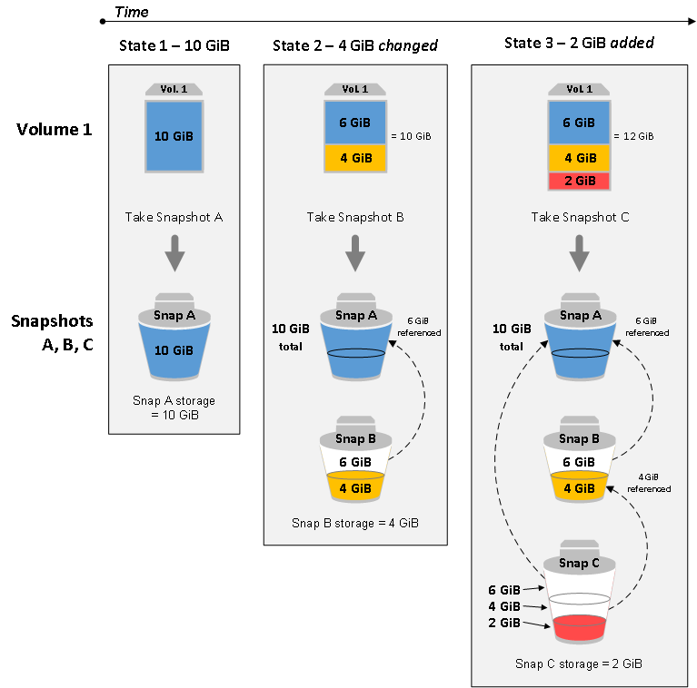

# EBS and Instance store

## Concepts

### Storage for Instances (EBS)
Amazon Elastic Block Store (Amazon EBS) provides block level storage volumes for use with EC2 instances. EBS volumes behave like raw, unformatted block devices. You can mount these volumes as devices on your instances. EBS volumes that are attached to an instance are exposed as storage volumes that persist independently from the life of the instance. You can create a file system on top of these volumes, or use them in any way you would use a block device (such as a hard drive). You can dynamically change the configuration of a volume attached to an instance. 
EBS Volume types:
* **gp2 - General Purpose SSD**: base performance of ***3 IOPS/GiB***, with the ability to ***burst to 3,000 IOPS*** for extended periods of time. These volumes are ideal for a broad range of use cases such as boot volumes, small and medium-size databases, and development and test environments. 
* **io1, io2 - Provisioned IOPS SSD**:  supports ***up to 64,000 IOPS and 1,000 MiB/s of throughput***. This allows you to predictably scale to tens of thousands of IOPS per EC2 instance. 
* **st1 - Throughput Optimized HDD**:  provide low-cost magnetic storage that defines performance in terms of ***throughput rather than IOPS***. 
* **sc1 - Cold HDD**: provides ***low-cost magnetic storage*** that defines performance in terms of ***throughput rather than IOPS***. These volumes are ideal for large, sequential, cold-data workloads. If you require infrequent access to your data and are looking to save costs, these volumes provides inexpensive block storage. 

**By default EBS volume is deleted when the instance is terminated.**

### EBS & Instance Store Tips:
* EBS volume always share the ***same Availability Zone*** as the Instance.
* Volumes are not encrypted by default.
* **Root volume** is marked to be ***deleted on termination*** by default. 
* **Additional volumes** are ***not marked to be deleted in termination***.
* Change an EBS volume from one Availability Zone to another: 
  1. Create an Snapshot of the EBS Volume
  2. Convert the snapshot in an AMI
  3. Copy the AMI to the destination region (If the target AZ is in another Region)
  4. Deploy an instance in the destination AZ using the AMI
* **Snapshots are stored in S3**, and they are incremental. Only the deltas are stored.
* Is a good practice to **stop the instance before you take an snapshot**. You can do it when the instance is running but the filesystem integrity could be compromised.
* You can **change EBS volume on the fly**, even size or storage type. The filesystem is not modified, so the partition needs to be modified manually.
* Multiple instance store can be added at launching, but not later. EBS can be added on the fly.
* Instances store cannot be seen under the EBS Volume list. 
* Instance store some times is called ephemeral storage, because they are destroyed when the instance is terminated.
* **Instance store backed instances cannot be stopped**, only rebooted or terminated. 
* Instance store disk persist along the reboot.
* You can create an encrypted volume from scratch.
* If you want to create an encrypted EBS from an un-encrypted volume,  you need to create an snapshot (Un encrypted), copy to same region encrypted and then use the encrypted snapshot to create an AMI, and last, launch a new instance with the volume encrypted.
* Once a volume is encrypted, all the snapshots are going to be encrypted. If you want to share the image or the snapshot, you can't do it without un encrypted.
* **HDD (st1, sc1) are going to be always cheaper than SSD options (io1, gp2)**

### Snapshots

You can **back up the data on your Amazon EBS volumes to Amazon S3** by taking point-in-time snapshots. **Snapshots are incremental backups**, which means that only the blocks on the device that have changed after your most recent snapshot are saved. This minimizes the time required to create the snapshot and saves on storage costs by not duplicating data. Each snapshot contains all of the information that is needed to restore your data (from the moment when the snapshot was taken) to a new EBS volume.

When you create an EBS volume based on a snapshot, the new volume begins as an exact replica of the original volume that was used to create the snapshot.

The **replicated volume loads data in the background** so that you can begin using it immediately. If you access data that hasn't been loaded yet, the volume immediately downloads the requested data from Amazon S3, and then continues loading the rest of the volume's data in the background.

**Charges** for your snapshots are based on the **amount of data stored**. Because snapshots are incremental, ***deleting a snapshot might not reduce your data storage costs***. Data referenced exclusively by a snapshot is removed when that snapshot is deleted, but ***data referenced by other snapshots is preserved***. 

### Snapshot encryption
* EBS snapshots fully support EBS encryption.
* Snapshots of encrypted volumes are automatically encrypted.
* Volumes that you create from encrypted snapshots are automatically encrypted.
* Volumes that you create from an unencrypted snapshot that you own or have access to can be encrypted on-the-fly.
* When you copy an unencrypted snapshot that you own, you can encrypt it during the copy process.
* When you copy an encrypted snapshot that you own or have access to, you can reencrypt it with a different key during the copy process.
* The first snapshot you take of an encrypted volume that has been created from an unencrypted snapshot is always a full snapshot.
* The first snapshot you take of a reencrypted volume, which has a different CMK compared to the source snapshot, is always a full snapshot.

### Sharing snapshots

By modifying the permissions of a snapshot, **you can share it with the AWS accounts that you specify**. Users that you have authorized can use the snapshots you share as the basis for creating their own EBS volumes, while your **original snapshot remains unaffected**.

If you choose, you can make your unencrypted snapshots available publicly to all AWS users. **You can't make your encrypted snapshots available publicly.**

### Amazon Data Lifecycle Manager & EBS

You can use Amazon Data Lifecycle Manager to automate the creation, retention, and deletion of snapshots that you use to back up your Amazon EBS volumes. A lifecycle policy consists of these core settings:
* **Resource type** — Defines the type of AWS resource managed by the policy. Use VOLUME to create snapshots of individual volumes or use INSTANCE to create multi-volume snapshots from the volumes for an instance. For more information, see Multi-volume snapshots.
* **Target tags** — Specifies the tags that must be associated with an EBS volume or an Amazon EC2 instance for it to be managed by the policy.
* **Schedules** - The start times and intervals for creating snapshots. The first snapshot is created by a policy within one hour after the specified start time. Subsequent snapshots are created within one hour of their scheduled time. A policy can have up to four schedules; one mandatory schedule and up to three optional schedules. For more information, see Policy schedules.
* **Retention** — Specifies how snapshots are retained. You can retain snapshots based on either the total count of snapshots or the age of each snapshot.