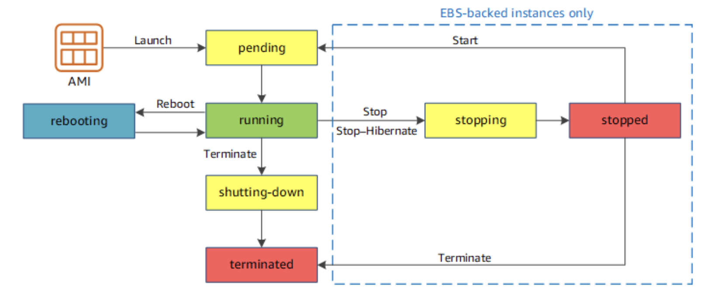
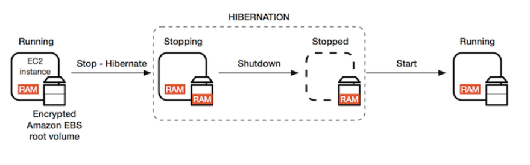

# Name
## Concepts

### Price Models
* **On-Demand**: you pay for compute capacity by the hour or the second depending on which instances you run. No longer-term commitments or upfront payments are needed. You can increase or decrease your compute capacity depending on the demands of your application and only pay the specified per hourly rates for the instance you use. Useful for:
  * Low cost and flexibility without any up-front payment or long-term commitment
  * Applications with short term execution, spiky, or unpredictable workloads that cannot be interrupted.
  * Application being tested of developed in AWS for the first time.
* **Reserved**: provide you with a significant discount (up to 75%) compared to On-Demand instance pricing. In addition, when Reserved Instances are assigned to a specific Availability Zone, they provide a capacity reservation, giving you additional confidence in your ability to launch instances when you need them. For applications that have steady state or predictable usage, Reserved Instances can provide significant savings compared to using On-Demand instances. **Standard Reserved Instances** provide you with a significant discount (up to 72%) compared to On-Demand Instance pricing, and can be purchased for a 1-year or 3-year term. Customers have the flexibility to change the Availability Zone, the instance size, and networking type of their Standard Reserved Instances. **Purchase Convertible Reserved** Instances if you need additional flexibility, such as the ability to use different instance families, operating systems, or tenancies over the Reserved Instance term. Convertible Reserved Instances provide you with a significant discount (up to 54%) compared to On-Demand Instances and can be purchased for a 1-year or 3-year term. Reserved Instances are recommended for:
  * Applications with steady state usage
  * Applications that may require reserved capacity
  * Customers that can commit to using EC2 over a 1 or 3 year term to reduce their total computing costs
* **Spot Instances**: Allow you to request spare Amazon EC2 computing capacity for up to 90% off the On-Demand price. Spot instances are created when AWS accept your proposed price, and terminated by AWS when the price rise over your bid. **You are charged by a full hour (round up) but if AWZ was who terminated the instance, it's rounded  down**. Spot instances are recommended for:
  * Applications that have flexible start and end times
  * Applications that are only feasible at very low compute prices
  * Users with urgent computing needs for large amounts of additional capacity
* **Dedicated Host**: physical EC2 server dedicated for your use. Dedicated Hosts can help you reduce costs by allowing you to use your existing server-bound software licenses, including Windows Server, SQL Server, and SUSE Linux Enterprise Server (subject to your license terms), and can also help you meet compliance requirements. 
  * Can be purchased On-Demand (hourly).
  * Can be purchased as a Reservation for up to 70% off the On-Demand price.

## Instance types
* **General purpose**: provide a ***balance of compute, memory and networking resources***, and can be used for a variety of diverse workloads. These instances are ideal for applications that use these resources in equal proportions such as web servers and code repositories. Instances models:
  * T: small
  * A: ARM
  * M: Medium
* **Compute Optimized**: ideal for compute bound applications that benefit from ***high performance processors***. Instances belonging to this family are well suited for batch processing workloads, media transcoding, high performance web servers, high performance computing (HPC), scientific modeling, dedicated gaming servers and ad server engines, machine learning inference and other compute intensive applications. Instances models:
  * C4, C5, C6g  
* **Memory Optimized** designed to deliver fast performance for workloads that process ***large data sets in memory***. Instances models:
  * R: More Ram per CPU
  * X: Low cost per ram
  * High memory: biggest memory options
  * z1d: High speed memory
* **Accelerated Computing**: use ***hardware accelerators, or co-processors***, to perform functions, such as floating point number calculations, graphics processing, or data pattern matching, more efficiently than is possible in software running on CPUs.
* **Storage Optimized**: designed for workloads that require ***high, sequential read and write access to very large data sets on local storage***. They are optimized to deliver tens of thousands of low-latency, random I/O operations per second (IOPS) to applications. Instances models:
  * I: Non-Volatile Memory Express (NVMe) SSD
  * D: up to 48 TB of HDD-based local storage. high disk throughput
  * H: up to 16 TB of HDD-based local storage, deliver high disk throughput

## Lifecycle
An Amazon EC2 instance transitions through different states from the moment you launch it through to its termination. The following illustration represents the transitions between instance states. Notice that you can't stop and start an instance store-backed instance.

Rebooting an instance doesn't start a new instance billing period because the instance stays in the running state.
Only Running state is billed, except for instances going to hibernate, were the the stopping state is also billed.
**Termination Protection is off by default**. Once enabled, the Instance cannot be deleted. 

## Hibernate tips
* **Hibernation**: ***Saves RAM-to-Disk*** before stop the instance, and ***restore RAM*** immediately ***after start*** the instance back. EBS blocks persist.
*  Instance keeps it ID, private IP addresses.
*  **Auto-assigned public IPs are released**, except for Elastic IPs.
*  **RAM must be less than 150GB.** Instance must be EBS backed.
*  EBS volume must be large enough to hold instance data and RAM.
*  **EBS volume is forced to be encrypted** for Hibernate capable machines.
*  **Hibernate must be enabled at launch, it cannot be enabled later (running or stopped)**
*  Not supported on Spot Instances
*  **Machines cannot hibernate for more than 60 days.** If you need a longer period, restore it, stop it, start it and hibernate it again. 
*  If there is critical patch that needs to be applied in an hibernated machine, you will be notified.

## Storage for Instances (EBS)

Amazon Elastic Block Store (Amazon EBS) provides block level storage volumes for use with EC2 instances. EBS volumes behave like raw, unformatted block devices. You can mount these volumes as devices on your instances. EBS volumes that are attached to an instance are exposed as storage volumes that persist independently from the life of the instance. You can create a file system on top of these volumes, or use them in any way you would use a block device (such as a hard drive). You can dynamically change the configuration of a volume attached to an instance. 
EBS Volume types:
* **gp2 - General Purpose SSD**: base performance of ***3 IOPS/GiB***, with the ability to ***burst to 3,000 IOPS*** for extended periods of time. These volumes are ideal for a broad range of use cases such as boot volumes, small and medium-size databases, and development and test environments. 
* **io1, io2 - Provisioned IOPS SSD**:  supports ***up to 64,000 IOPS and 1,000 MiB/s of throughput***. This allows you to predictably scale to tens of thousands of IOPS per EC2 instance. 
* **st1 - Throughput Optimized HDD**:  provide low-cost magnetic storage that defines performance in terms of ***throughput rather than IOPS***. 
* **sc1 - Cold HDD**: provides ***low-cost magnetic storage*** that defines performance in terms of ***throughput rather than IOPS***. These volumes are ideal for large, sequential, cold-data workloads. If you require infrequent access to your data and are looking to save costs, these volumes provides inexpensive block storage. 

## EBS & Instance StoreTips:
* EBS volume always share the ***same Availability Zone*** as the Instance.
* Volumes are not encrypted by default.
* **Root volume** is marked to be ***deleted on termination*** by default. 
* **Additional volumes** are ***not marked to be deleted in termination***.
* Change an EBS volume from one Availability Zone to another: 
  1. Create an Snapshot of the EBS Volume
  2. Convert the snapshot in an AMI
  3. Copy the AMI to the destination region (If the target AZ is in another Region)
  4. Deploy an instance in the destination AZ using the AMI
* **Snapshots are stored in S3**, and they are incremental. Only the deltas are stored.
* Is a good practice to **stop the instance before you take an snapshot**. You can do it when the instance is running but the filesystem integrity could be compromised.
* You can **change EBS volume on the fly**, even size or storage type. The filesystem is not modified, so the partition needs to be modified manually.
* Multiple instance store can be added at launching, but not later. EBS can be added on the fly.
* Instances store cannot be seen under the EBS Volume list. 
* Instance store some times is called ephemeral storage, because they are destroyed when the instance is terminated.
* **Instance store backed instances cannot be stopped**, only rebooted or terminated. 
* Instance store disk persist along the reboot.
* You can create an encrypted volume from scratch.
* If you want to create an encrypted EBS from an unencrypted volume,  you need to create an snapshot (Un encrypted), copy to same region encrypted and then use the encrypted snapshot to create an AMI, and last, launch a new instance with the volume encrypted.
* Once a volume is encrypted, all the snapshots are going to be encrypted. If you want to share the image or the snapshot, you can't do it without un encrypted.
  
## Spot Instances
* A Spot Instance is an **unused EC2 instance** that is available for less than the On-Demand price. Up to 90% less.
* Spot Instances are a cost-effective choice if you can be flexible about when your applications run and if your applications can be interrupted.
* Spot price is how much it cost at a given moment the hour of that instance. In the moment that the spot price is lower than you limit price, the machine is provisioned and will be running as long the spot below your max price. If the price goes over, the machine will receive a notification that will be terminated. 
* You can use **spot block to lock an spot machine so is not terminated**, even if the price goes over your spot price limit. 
* You make a request specifying the spot price limit, how many instances you want, launch specifications and time range where the request is valid. The request could be:
  * One-time: When the request is activated, it creates the instances and when the instances are terminated, the request is deleted.
  * Persistent: The request persist the instances termination and when the spot price is lower your limit, the instances are created again. 
* Spot Fleets is a combination of spot and on-demand instances created to cover a target capacity. Target is maintained if the spot instances are interrupted. Each fleets contains different pools to be filled and they are filled using different strategies:
  * lowestPrice: The Spot Instances come from the pool with the lowest price. This is the default strategy.
  * diversified :The Spot Instances are distributed across all pools.
  * capacityOptimized: The Spot Instances come from the pool with optimal capacity for the number of instances that are launching.
  * InstancePoolsToUseCount: The Spot Instances are distributed across the number of Spot pools that you specify. This parameter is valid only when used in combination with lowestPrice.
* Spot fleets pools are defined on: Availability Zone, machine type and operating system. 
  
## AMI Tips
* Are based on snapshots and must be created in each region. 
* Can be shared between accounts.
* AMI defines Instance configuration pre-defined configuration, like volume size or type. Some of them can be changed later. 
* Can be backed (use storage from) by:
  * EBS Volume created from EBS Snapshot
  * Instance Store (volatile block storage created from S3 stored template)

## Security Groups Tips
* Security groups are stateful. Use connection tracking.
* All **inbound** port are **blocked** by default. Even the ones used to administer the instance (SSH, RDP)
* All **outbound** traffic is **enabled** by default. 
* Changes in security groups are applied immediately.
* Security group rules are always permissive; **you can't create rules that deny access**.
* A Security group rule can have another security rule as source (inbound rules) or destination (inbound rules). All other resources associated with that Security Group are considered valid sources/destinations.
* Multiple instances can have the same Security Group.

## Network Interfaces Tips
* There are three type of interfaces
  * **Elastic Network Interface (ENI)**: Virtual network interface. Supports one primary private IP and multiple secondaries IPs. One Elastic IP per private. One auto assigned public IPs. One MAC address and one o multiple Security Groups.
  * **Enhanced Networking (ENA)**: single root i/o virtualization (SR-IOV). Higher performance and lower CPU usage. Provides higher packet per seconds and bandwidth. No additional cost to use it. Suport 100Gb (prefered) and 10Gb (VF)
  * **Elastic Fabric Adapter (EFA)**: accelerates High Performance Computing (HPC) and machine learning applications. ***EFA enables you to achieve the application performance of an on-premises HPC cluster, with the scalability, flexibility, and elasticity provided by the AWS Cloud***.
* Elastic Network Adapters (ENAs) provide traditional IP networking features that are required to support VPC networking. ***EFAs provide all of the same traditional IP networking features as ENAs, and they also support OS-bypass capabilities***. OS-bypass enables HPC and machine learning applications to bypass the operating system kernel and to communicate directly with the EFA device.
* How to choose the right interface type in the use cases:
  * ENI => cheapest. Multiple homes instances.
  * ENA => 10Gb or 100Gb BW
  * EFA => High Performance Computing (HPC). Consistent latency.

## Labs about
*

## References and complementary readings

