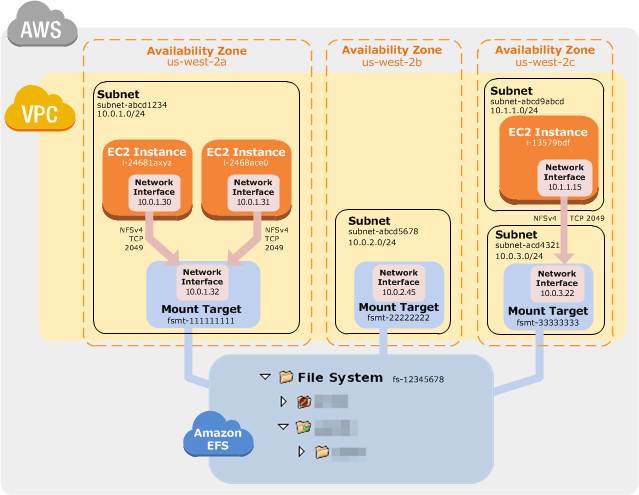

# EFS
## Concepts
Amazon EFS provides **file storage in the AWS Cloud**. With Amazon EFS, you can create a file system, mount the file system on an Amazon EC2 instance, and then read and write data to and from your file system.

You can access your Amazon EFS file system **concurrently** from multiple NFS clients, so applications that scale beyond a single connection can access a file system. Amazon EC2 instances running in **multiple Availability Zones within the same AWS Region can access the file system**, so that many users can access and share a common data source.

**An Amazon EFS file system can only have mount targets in one VPC at a time.**

To access your Amazon EFS file system in a VPC, you create one or more mount targets in the VPC. A **mount target provides an IP address for an NFSv4 endpoint** at which you can mount an Amazon EFS file system.

You can mount your Amazon EFS file systems on your on-premises data center servers when connected to your Amazon VPC with AWS Direct Connect or AWS VPN You can mount your EFS file systems on on-premises servers to migrate datasets to EFS, enable cloud bursting scenarios, or backup your on-premises data to EFS.

EFS capacity is elastic, growing and shrinking automatically.

## Essential Tips
* EFS support NFSv4 protocol.
* Scales up to Petabytes
* Supports thousands of concurrent NFS connections
* Data is stored across multiples AZ in a region
* Is provides Read-After-Write consistency. 
* Write operations are durably stored across Availability Zones in these situations:
  * file open with O_DIRECT flag, or the fsync command.
  * When the file closed.
* You can have two storage classes for EFS:
  * **Infrequent Access** – The Infrequent Access (IA) storage class is a lower-cost storage class that's designed for storing long-lived, infrequently accessed files cost-effectively.
  * **Standard** – The Standard storage class is used to store frequently accessed files.
* **Amazon EFS lifecycle** management automatically manages cost-effective file storage for your file systems. When enabled, lifecycle management migrates files that haven't been accessed for a set period of time to the Infrequent Access (IA) storage class. You define that period of time by using a lifecycle policy.