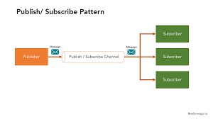
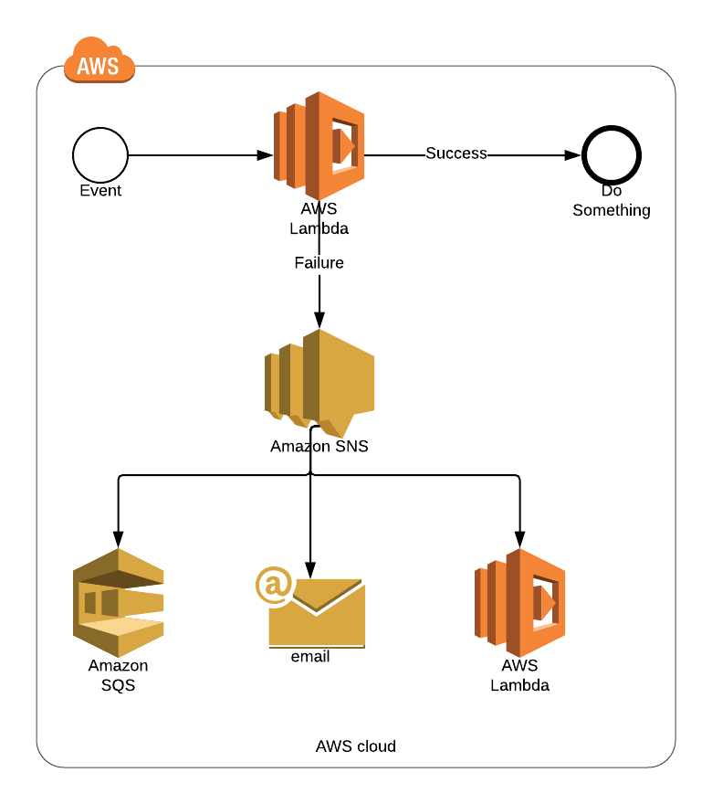
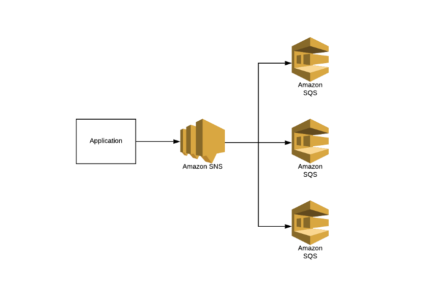

# Event Patterns
## Concepts

Events patterns help to decouple applications. The system-to-system pub/sub functionality provides topics for high-throughput, push-based, many-to-many messaging.

SNS is the key component to implement a Pub/Sub pattern. 

## Dead Letter Queue (DLQ)

Queue where all the failed messages are placed to be analyzed later.

## Fanout Pattern

Using SNS and SQS together to distribute works to multiple subscribers. The SQS queue per subscriber allows to manage different subscribers speed and error. 

## S3 Event Notifications

S3 can trigger notification on objects modification. The following triggers are allowed:
* **ObjectCreated**: creation of object
* **ObjectRemoved**: deletes of versioned or unversioned objects
* **ObjectRestored**: Restored from Glacier
* **RRS Object Lost**: Detection of a RR storage lost
* **Replication**: Replication failed, took more than 15 minutes or the object is not longer replicated.

Any message can be directed to SQS, SNS or Lambda.

## Exam Tips

* **Pub/Sub pattern** - A publisher/Subscriber model implemented by **SNS**.
* **Dead Letter Queue** let to collect all the **messages/call that failed**. Supported by: 
  * **SNS** Messages published that cannot be processed are redirected to a SQS queue and help for further analysis.
  * Messages sent to **SQS** that exceed the queue's maxReceiveCount are sent to a DLQ
  * **Lambda** failures for asynchronous invocations will retry twice and send to either a SQS queue or SNS topic.
* **Fanout pattern** is typically implemented using **SNS & SQS**
* **S3 notifications** on object changes are sent to **SNS, SNS or Lambda**.