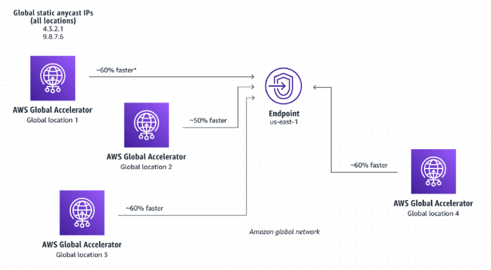
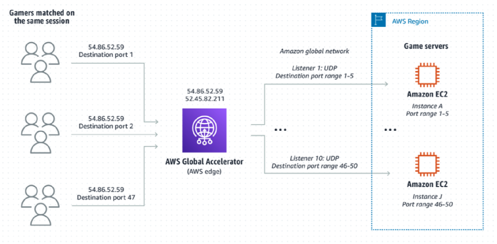

# Global Accelerators
## Concepts

AWS Global Accelerator is a service in which you **create accelerators to improve availability and performance of your applications for local and global users**. Global Accelerator **directs traffic to optimal endpoints** over the AWS global network. This improves the availability and performance of your internet applications that are used by a global audience. Global Accelerator is a global service that supports endpoints in multiple AWS Regions.

With Global Accelerator, you are provided **two global static customer facing Anycast IPs to simplify traffic management**. On the back end, add or remove your **AWS application origins, such as Network Load Balancers, Application Load Balancers, Elastic IPs, and EC2 Instances, without making user facing changes**. To mitigate endpoint failure, Global Accelerator automatically re-routes your traffic to your nearest healthy available endpoint.

Components of Global Accelerators:
* **Static IP addresses** - Global Accelerator provides you with a set of  addresses that are **anycast** from the **AWS edge network**. The IP addresses serve as single fixed entry points for your clients. 
* **Accelerator** - directs traffic to optimal endpoints over the AWS global network to improve the availability and performance of your internet applications. Each accelerator includes one or more listeners.
* **DNS name** - Global Accelerator assigns each accelerator a default Domain Name System (DNS) name, similar to **a1234567890abcdef.awsglobalaccelerator.com**, that points to the static IP addresses that Global Accelerator assigns to you or that you choose from your own IP address range. 
* **Network zone** - A network zone services the static IP addresses for your accelerator from a unique IP subnet. Similar to an AWS Availability Zone, a network zone is an isolated unit with its own set of physical infrastructure. 
* **Listener** - **processes inbound connections** from clients to Global Accelerator, **based on the port (or port range) and protocol** that you configure. Global Accelerator **supports both TCP and UDP protocols**. Each listener has one or more endpoint groups associated with it, and **traffic is forwarded to endpoints in one of the groups**. 
* **Endpoint group** - Each endpoint group is associated with a specific AWS Region. Endpoint groups include one or more endpoints in the Region. 
* **Endpoint** - Endpoints can be Network Load Balancers, Application Load Balancers, EC2 instances, or Elastic IP addresses. An Application Load Balancer endpoint can be an internet-facing or internal. Traffic is routed to endpoints based on configuration options that you choose, such as endpoint weights. For each endpoint, you can configure weights, which are numbers that you can use to specify the proportion of traffic to route to each one. This can be useful, for example, to do performance testing within a Region.

Anycast IPs to route traffic to the closer Network Zone

Listeners

## Exam Tips
* AWS Global Accelerator is a service in which you create **accelerators** to improve **availability and performance** of your applications for **local and global users**.
* You are assigned **two static anycast IP addresses** (you can bring your own IPs).
* You can control traffic using **dials** in endpoint groups. It **manages traffic distribution between Endpoint Groups**.
  