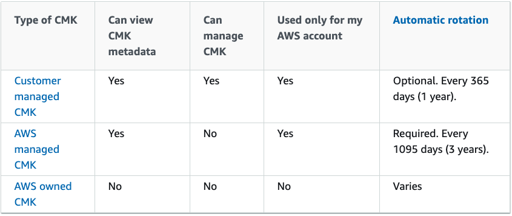

# Key Management Service (KMS)
## Concepts

AWS Key Management Service (**AWS KMS) is a managed service** that makes it easy for you to create and **control customer master keys (CMKs), the encryption keys used to encrypt your data.** AWS KMS CMKs are protected by hardware security modules (HSMs) that are validated by the FIPS 140-2 Cryptographic Module Validation Program except in the China (Beijing) and China (Ningxia) Regions.

### Customer master keys (CMKs)
A customer master key (CMK) is a logical representation of a master key. The CMK includes metadata, such as the key ID, creation date, description, and key state. The CMK also contains the key material used to encrypt and decrypt data.

**AWS KMS supports symmetric and asymmetric CMKs**. A symmetric CMK represents a 256-bit key that is used for encryption and decryption. An asymmetric CMK represents an RSA key pair that is used for encryption and decryption or signing and verification (but not both), or an elliptic curve (ECC) key pair that is used for signing and verification.

CMKs are created in AWS KMS. **Symmetric CMKs and the private keys of asymmetric CMKs never leave AWS KMS unencrypted**.

AWS KMS supports three types of CMKs: customer managed CMKs, AWS managed CMKs, and AWS owned CMKs.

* **Customer managed CMKs** are CMKs in your AWS account that **you create, own, and manage**. You have full control over these CMKs. You can use your customer managed CMKs in cryptographic operations and **audit their use in AWS CloudTrail logs**.
* **AWS managed CMKs** are CMKs in your account that **are created, managed, and used on your behalf by an AWS service** that is integrated with AWS KMS. **You can view** the AWS managed CMKs in your account, view their key policies, and **audit their use in AWS CloudTrail logs.**
* **AWS owned CMKs** are a collection of CMKs that an **AWS service owns and manages for use in multiple AWS accounts**. Although AWS owned CMKs are not in your AWS account, **an AWS service can use its AWS owned CMKs to protect the resources in your account**.

### Aliases

An alias is a **friendly name for a CMK**. Aliases make it easier to identify a CMK in the AWS Management Console. You can also use an alias to identify a CMK in some AWS KMS operations, including cryptographic operations. In applications, you can use a single alias to refer to different CMKs in each AWS Region.

In AWS KMS, **aliases are independent resources**, not properties of a CMK. As such, **you can add, change, and delete an alias without affecting the associated CMK.**

### Key policies

When you create a CMK, you determine **who can use and manage that CMK**. These permissions are contained in a document called the key policy. You can use the key policy to add, remove, or change permissions at any time for a customer managed CMK. **But you cannot edit the key policy for an AWS managed CMK**. 

You can reference CMK or Alias in the ARN of security Policies. 

### Envelope encryption
When you encrypt your data, your data is protected, but you have to protect your encryption key. One strategy is to encrypt it. E**nvelope encryption is the practice of encrypting plaintext data with a data key, and then encrypting the data key under another key.**

You can even encrypt the data encryption key under another encryption key, and encrypt that encryption key under another encryption key. But, eventually, one key must remain in plaintext so you can decrypt the keys and your data. This top-level plaintext key encryption key is known as the **master key**.

**AWS KMS helps you to protect your master keys by storing and managing them securely.** Master keys stored in AWS KMS, known as customer master keys (CMKs), never leave the AWS KMS FIPS validated hardware security modules unencrypted. **To use an AWS KMS CMK, you must call AWS KMS**.

Envelope encryption offers several benefits:
* **Protecting data keys** - When you encrypt a data key, you don't have to worry about storing the encrypted data key, because the data key is inherently protected by encryption. **You can safely store the encrypted data key alongside the encrypted data.**
* **Encrypting the same data under multiple master keys** - Encryption operations can be time consuming, particularly when the data being encrypted are large objects. Instead of re-encrypting raw data multiple times with different keys, you can **re-encrypt only the data keys that protect the raw data**.
* **Combining the strengths of multiple algorithms** - In general, symmetric key algorithms are faster and produce smaller ciphertexts than public key algorithms. But public key algorithms provide inherent separation of roles and easier key management. Envelope encryption lets you combine the strengths of each strategy.

## Exam-Tips
* **Regional** secure key service. Secrets does not leave the region.
* Always include the **root account as a default policy** in your KMS policies. If you deletes lose access to your KMS policy, you must ask AWS Support to re enable. 
* If you need to **move a Key from one region to another**, you need to **decrypt the object and encrypt it again** in the destination region.
* For large amount of data, **envelop encryption allows you to use KMS to encrypt the master-key**, so you can encrypt and decrypt locally using an KMS encrypted key. 
* **KMS supports only FIPS140-2 Level 2**
