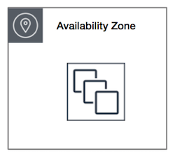
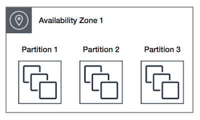
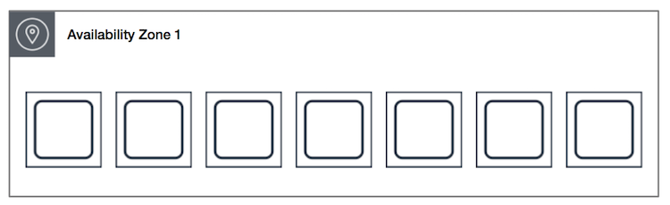

# Placement groups
## Concepts

When you launch a new EC2 instance, the EC2 service attempts to place the instance in such a way that all of your instances are spread out across underlying hardware to minimize correlated failures. You can use ***placement groups*** to influence the placement of a group of interdependent instances to meet the needs of your workload. 

Depending on the type of workload, you can create a placement group using one of the following placement strategies:
* **Cluster** – packs ***instances close together inside an Availability Zone***. This strategy enables workloads to achieve the ***low-latency network performance*** necessary for tightly-coupled ***node-to-node communication*** that is typical of ***HPC applications***.

* **Partition** – spreads your instances across ***logical partitions*** such that groups of instances in ***one partition do not share the underlying hardware*** with groups of instances in ***different partitions***. This strategy is typically used by large distributed and replicated workloads, such as Hadoop, Cassandra, and Kafka.

* **Spread** – strictly places a ***small group of instances across distinct underlying hardware*** to reduce correlated failures.

There is no charge for creating a placement group.

## Exam tips

* Clustered placement group
  * Low Network Latency
  * High network Throughput
  * ***Can not span over multiple Availability Zones***
  * AWS recommends homogenous instances in cluster placement group
* Spread Placement Group
  * Individual Critical EC2 Instances
  * ***Span over multiple Availability Zones***
* Partitioned Placement Group
  * Multiple EC2 instances like in distributed workloads HDFS, HBase & Cassandra
  * ***Can span over multiple Availability Zones***
* Placement Group name is **unique per AWS account**
* Only **some instance types** can be launched in placement groups
  * Compute optimize
  * GPU
  * Memory optimize
  * Storage optimize
* You **can't merge** placement groups.
* You **can move instances from one Placement Group** to other but the instance needs to be in **stopped state**. You can do it with the CLI, API but not in the Console. 