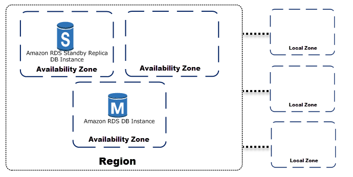

# RDS
## Concepts
Amazon Relational Database Service (Amazon RDS) is a web service that makes it easier to set up, operate, and scale a relational database in the AWS Cloud. It provides cost-efficient, resizable capacity for an industry-standard relational database and manages common database administration tasks.

Supported Engines:
* MariaDB
* PostgreSQL
* Oracle
* SQL Server
* Aurora (Amazon)
* MySQL

Why do you want a managed relational database service? Because Amazon RDS takes over many of the difficult or tedious management tasks of a relational database:
* When you buy a server, you get **CPU, memory, storage, and IOPS**, all bundled together. With Amazon RDS, these are split apart so that you can **scale them independently**. If you need more CPU, less IOPS, or more storage, you can easily allocate them.
* Amazon **RDS manages backups, software patching, automatic failure detection, and recovery.**
* To deliver a managed service experience, **Amazon RDS doesn't provide shell access to DB instances**. It also restricts access to certain system procedures and tables that require advanced privileges.
* You can h**ave automated backups** performed when you need them, or manually create your own backup snapshot. You can use these **backups to restore a database**. The Amazon RDS restore process works reliably and efficiently.
* You can get **high availability** with a primary instance and a synchronous secondary instance that you can fail over to when problems occur. You can also use **MySQL, MariaDB, or PostgreSQL read replicas to increase read scaling**.
* You can use the database products you are already familiar with: **MySQL, MariaDB, PostgreSQL, Oracle, Microsoft SQL Server and Amazon Aurora.**
* In addition to the security in your database package, you can help **control who can access your RDS databases by using AWS Identity and Access Management (IAM)** to define users and permissions. You can also help protect your databases by putting them in a virtual private cloud.
  
The basic building block of Amazon RDS is the DB instance. A **DB instance is an isolated database environment in the AWS Cloud**. Your DB instance can contain multiple user-created databases.

A **security group** controls the access to a DB instance. It does so by allowing access to IP address ranges or Amazon EC2 instances that you specify.

## RDS Price

Amazon RDS instances are billed based on the following components:
* **DB instance hours** (per hour, second fragment) – Based on the DB instance class of the DB instance (for example, db.t2.small or db.m4.large). Pricing is listed on a per-hour basis, but bills are calculated down to the second and show times in decimal form. RDS usage is billed in one second increments, with a minimum of 10 minutes. 
* **Storage** (per GiB per month) – Storage capacity that you have provisioned to your DB instance. If you scale your provisioned storage capacity within the month, your bill is pro-rated. 
* **Backup storage** (per GiB per month) – Backup storage is the storage that is associated with automated database backups and any active database snapshots that you have taken. Increasing your backup retention period or taking additional database snapshots increases the backup storage consumed by your database. ***Per second billing doesn't apply to backup storage (metered in GB-month).***
* **Data transfer** (per GB) – Data transfer in and out of your DB instance ***from or to the internet and other AWS Regions***.
* **I/O requests** (per 1 million requests per month, magnetic storage only) – Total number of storage I/O requests that you have made in a billing cycle, for Amazon RDS ***magnetic storage only***.
* **Provisioned IOPS** (per IOPS per month, provisioned SSD only) – Provisioned IOPS rate, regardless of IOPS consumed, for ***Amazon RDS Provisioned IOPS (SSD) storage only***. Provisioned storage for EBS volumes are billed in one second increments, with a minimum of 10 minutes.

## High Availability (Multi AZ) 

In a Multi-AZ deployment, Amazon RDS automatically provisions and maintains a synchronous standby replica in a different Availability Zone. The primary DB instance is synchronously replicated across Availability Zones to a standby replica to provide data redundancy, eliminate I/O freezes, and minimize latency spikes during system backups. Running a DB instance with high availability can enhance availability during planned system maintenance, and help protect your databases against DB instance failure and Availability Zone disruption

Using the RDS console, you can create a Multi-AZ deployment by simply specifying **Multi-AZ when creating a DB instance**. You can use the console to **convert existing DB instances to Multi-AZ deployments** by modifying the DB instance and specifying the Multi-AZ option.