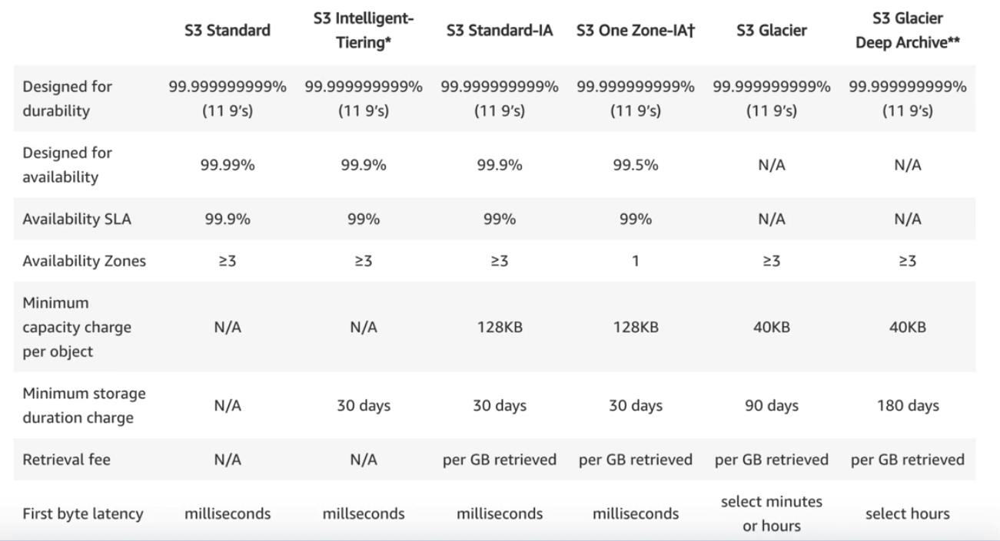
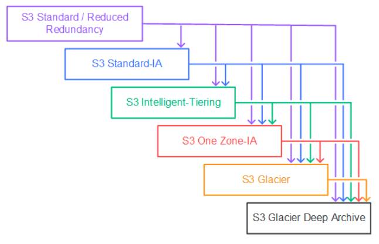
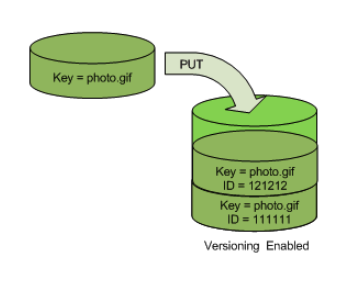
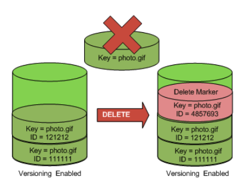
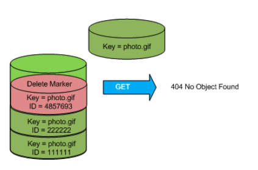
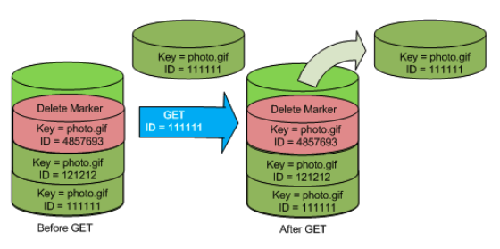
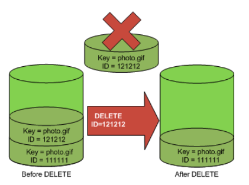

# S3
## Essential Tips
### General
* S3 stands for Simple Storage Service. Is unlimited.
* Object-Based. Store files in buckets. From 0 to 5TB
* Is a universal namespace. Like DNS, each bucket must be unique. 
* Bucket global address will be https://bucket-name.s3.amazonaws.com/
* Every successful operation with S3 will return an HTTP 200 OK response.
* Every Object has:
  * Key: name of the object
  * Value: Sequence of data associated with the Key
  * Version ID: Used in versioning
  * Metadata: Data about the object
  * Sub resources:
    * Access Control List
    * Torrent

### Features
* Tiered Storage Available: Different tiers of storage for your data
* Lifecycle: Moved data between storage tiers based on object age
* Versioning: to track different versions of your object.
* Encryption: Encrypt objects
* Multi factor authentication (MFA) on delete: To prevent unauthorized deletion. Protect your objects.
* Access control using ACLs and bucket policies

### Storage Classes
* Standard
* Infrequently Access (IA)
* One Zone (IA)
* Intelligent Tiering
* Glacier
* Glacier Deep Archive
* Reduced Redundancy Storage (RRS): Being faced out similar to One-Zone IA.
* S3 Standard is the most expensive. S3 Intelligence Tiering cost the same, but infrequently used objects are moved automatically to S3-IA, which is cheaper. The analysis of the objects cost, so if you have millions of objects it could be expensive.
* __S3 IA, OZ-IA & Intel Tiering only apply to objects larger than 128KB, stored for a minimum of 30-day term. Smaller object are charges as S3 Standard. Shorter period of time are charged for the 30 days.__

### Data consistency
* *Read after Writes Consistency* (PUTS of new object)
* *Eventual Consistency* for overwrite PUTS and DELETES (these operation takes time to propagate)

### Guarantees
* 99.999% availability for the S3 platform.
* 99.9% Guarantee availability
* 99.999999999 (11 9s) durability of the information
* For S3 Standard, S3 Standard-IA, and S3 Glacier storage classes, objects are automatically stored across multiple devices spanning a minimum of three Availability Zones in a region.
* S3 One Zone-IA storage class are stored redundantly within a single Availability Zone in the AWS Region you select.

### Charges on S3
* Pay for what you use. Costs vary per region (based on cost)
* *Storage* (Size of what you have storages). Versioning does not delete objects, so you pay for the storage of all the versions of the same object.
* *Requests*: PUT, COPY, POST, LIST are expensive than GET, SELECT request. DELETE and Cancel are free. Lifecycle transitions has a cost.
* Storage Management: Inventory, Analytics, Tagging and Replication
* *Data Transfer*: NOT Charged for S3 to EC2 in the same region, S3 to CloudFront and data transferred in from Internet.
* *Transfer Acceleration*: Used when you transfer to and Edge location and then Amazon transfer over their optimized speed network to the the S3 bucket
* *Cross Region Replication*: Automatic replication between regions when you upload an object

### Security
* ACL for Object-Access control, Bucket policies for bucket level security.
* HTTPS for on-transit encryption 
* Object encryption for data-in-rest encryption
* Access control is limited using:
  * IAM policies for users & roles
  * ACL on bucket policies
  * Query String Authenticators, to allow temporary access to objects based on URLs
* Access can be audited using CloudTrail
* Encryption can be done using
  * SSE-S3: Amazon managed S3 keys
  * SSE-C: Customer managed encryption keys
  * SSE-KMS: KMS encryption keys
  * Client side encryption.
* Access-Points allowed you to separate different access policies for each typo of consumer that you have, simplifying your bucket policies.
* Object-lock blocks object version deletion. Useful to enforce WORM (Write-Once-Read-Many) style storage.
* Amazon Macie is a AI service that will help you to discover and classify data in S3

### Lifecycle Management
* S3 Lifecycle management provides the ability to make object transitions between storage classes or object expirations (Amazon deletes expired objects on your behalf)
* You can also set lifecycle expiration policies to automatically remove objects based on the age of the object.
* There is no additional cost to set up and apply Lifecycle policies. A transition request is charged per object when an object becomes eligible for transition according to the Lifecycle rule.
* The S3 Lifecycle policy that expires incomplete multipart uploads allows you to save on costs by limiting the time non-completed multipart uploads are stored

### Versioning
* Stores all versions of an object (modifications, replacements and deletes).
* The versioning state applies to all (never some) of the objects in that bucket.
* Once enabled, it cannot be disabled, only suspended.
* Versioning MFA Delete use multi-factor authentication to protect unwanted deletes.

Versioning: Each versioning has a unique ID

Delete with Versioning is not a delete. Just a mark. 

Accessing a deleted object by key vs by key and ID

Permanent Delete by Name and ID

### Object Locks
* Used to store objects using a write-once-read-many (WORM) model.
* Prevents objects from being deleted or overwritten for a fixed amount of time or indefinitely.
* Object Lock provides two ways to manage object retention: retention periods and legal holds.
  * A retention period specifies a fixed period of time during which an object remains locked. During this period, your object is WORM-protected and can't be overwritten or deleted.
  * A legal hold provides the same protection as a retention period, but it has no expiration date. Instead, a legal hold remains in place until you explicitly remove it. Legal holds are independent from retention periods.
* Object Lock works only in versioned buckets, and retention periods and legal holds apply to individual object versions.
* When you lock an object version, Amazon S3 stores the lock information in the metadata for that object version. 
* S3 Object Lock provides two retention modes:
  * Governance mode: users can't overwrite or delete an object version or alter its lock settings unless they have special permissions.
  * Compliance mode: a protected object version can't be overwritten or deleted by any user, including the root user in your AWS account. When an object is locked in compliance mode, its retention mode can't be changed, and its retention period can't be shortened. Compliance mode ensures that an object version can't be overwritten or deleted for the duration of the retention period.
* S3 Glacier Vault Lock is for Glacier objects.

### Replication Management
* Amazon S3 Replication enables automatic, asynchronous copying of objects across Amazon S3 buckets. It requires Versioning enabled in source and destination bucket.
* Cross-Region Replication (CRR) automatically replicates data between buckets across different AWS Regions. 
* Same-Region Replication (SRR) is an Amazon S3 feature that automatically replicates data between buckets within the same AWS Region.
* With Replication CRR & SRR, you can set up replication at a bucket level, a shared prefix level, or an object level using S3 object tags.
* Can be used to:
  * Change account ownership for the replicated objects to protect data from accidental deletion.
  * Consolidate logs from multiple regions
  * Replica environment data (Development to Test)
* Lifecycle rules are not replicated. They need to be recreated. 
* Only SS3-KMS bucket can be replicated, but only if the destination bucket is encrypted with KMS. 
* Replication is done using SSL
* Replication Time Control is an SLA about the time taken to replicate the objects. 
* Does not replicate older objects than when replication was enabled. 
* Delete markers are not replicated, so you need to delete the object in destination bucket as well. 

### Limitations & Performance
* A single upload can be up to 5 GB. Objects higher than 100 MB it's recommended to use a Multipart upload. Multipart is required for files over 5Gb.
* Multipart upload allow parallelize uploads, increasing efficiency.
* In the same way, you can download in parts using S3 Byte-Range fetches. Speed-up downloads with concurrency and if a part fails, only that one needs to be re downloaded.
* S3 performance is limited by S3 Prefix. Prefix is the part of the key between the object name and the bucket name. 
  * `bucket-name/folder1/subfolder2/object.txt` **/folder1/subfolder2** is the prefix
* There is a limitation of 3,500 PUT/COPY/POST/DELETE or 5,500 GET/HEAD requests per second per prefix in a bucket.
* Distributing objects over different prefix will help to increase concurrency performance.
* When KMS object encryption is in use, each upload and download count in the KMS quota. Depending the region, there is a limitation on 5000 request per second. 

### Region for storage
* S3 can be accessed globally, but you need to choose in which region do you want to store your data
* Choose your region based on: 
  * Distance to whom is going to consume the data (reduce data latency)
  * Remote to increase your redundancy (disaster recovery purpose)
  * Legal & regulatory requirements
  * Reduce storage costs. Price varies from region to region.

### S3 Select
* Allows applications to retrieve a set of data from an object using simple SQL expressions increasing performance up to 400% faster and 80% cheaper.
* You can retrieve partial content of your object based on rows and columns.
* S3 Select for Glacier does the same in Glacier.

### S3 Share across accounts
* Using Bucket policies & IAM policies. Programmatic only. Applies to all the bucket.
* Using Bucket ACLs & IAM (on individual objects). Programmatic only.
* Cross-Account IAM Roles. Programmatic & Console access.

## Labs about
* [Static Website based on S3 and Lambda functions](webpage-s3-lambda/)
* [Static Website based on S3 sourcing from a CodeCommit Repository using Lambda](s3-site-from-repo/)

## References and complementary readings
* [S3 FAQ](https://aws.amazon.com/s3/faqs/) (must read before the exam)
