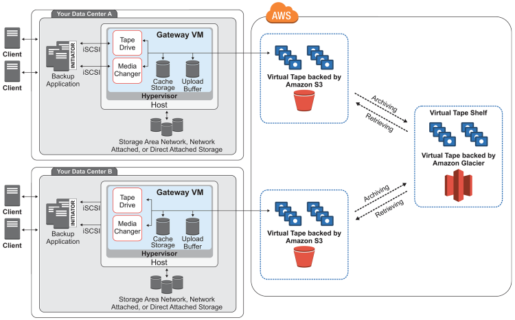

# Storage Gateway
## Concepts

AWS Storage Gateway connects an on-premises software appliance with cloud-based storage to provide seamless integration with data security features between your on-premises IT environment and the AWS storage infrastructure.

### Gateway Types
* **File Gateway**: supports a file interface into Amazon Simple Storage Service (Amazon S3) and combines a service and a virtual software appliance. By using this combination, you can store and retrieve objects in Amazon S3 using industry-standard file protocols such as **Network File System (NFS) and Server Message Block (SMB)**. 

* **Volume Gateway**: provides cloud-backed storage volumes that you can mount as Internet Small Computer System Interface (iSCSI) devices from your on-premises application servers. Supports the following volume configurations:
  * **Cached volumes** – You store your data in Amazon Simple Storage Service (Amazon S3) and retain a copy of frequently accessed data subsets locally. Cached volumes offer a substantial cost savings on primary storage and minimize the need to scale your storage on-premises. You also retain low-latency access to your frequently accessed data.
  * **Stored volumes** – If you need low-latency access to your entire dataset, first configure your on-premises gateway to store all your data locally. Then asynchronously back up point-in-time snapshots of this data to Amazon S3. This configuration provides durable and inexpensive offsite backups that you can recover to your local data center or Amazon Elastic Compute Cloud (Amazon EC2). For example, if you need replacement capacity for disaster recovery, you can recover the backups to Amazon EC2.

* **Tape Gateway**: A tape gateway provides cloud-backed virtual tape storage. 
* All options supports being deployed into your on-premises environment as a VM running on VMware ESXi, KVM, or Microsoft Hyper-V hypervisor.

## Exam Tips
* Storage Gateways are devices deployed on-premise to integrate local storage needs with S3.
* File Gateways offer NFS/SMB network file systems.
* Volume Gateways supports
  * Cached Volume - Offers iSCSI volumes cached locally and upload a copy of the data to an EBS volume. Then, the EBS incremental snapshot is stored in S3.
  * Stored Volume - Offers and upload incremental snapshots of your volume to S3. 
* Tape gateways offers virtual tape library (VTL) to be used with your local tape backup resources.

### References and complementary readings
* [What Is AWS Storage Gateway?](https://docs.aws.amazon.com/storagegateway/latest/userguide/WhatIsStorageGateway.html)
