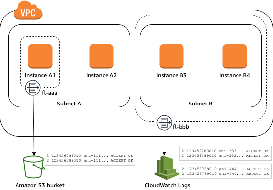
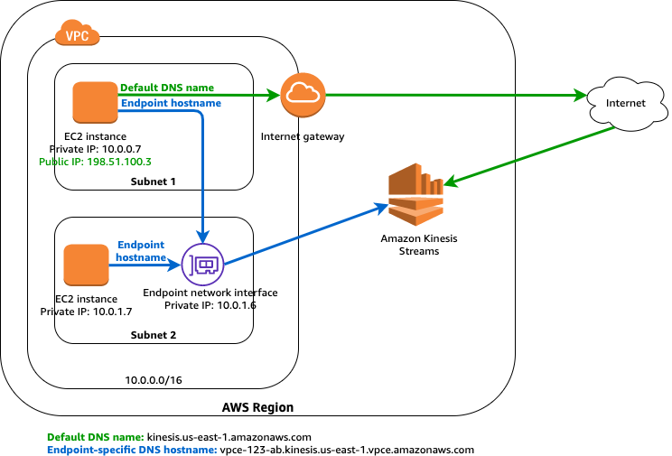
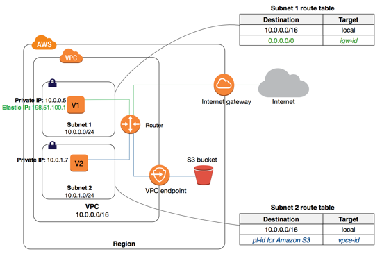

# VPC
## Concept

Amazon VPC is the networking layer for Amazon EC2. 

A virtual private cloud (VPC) is a virtual network dedicated to your AWS account. It is logically isolated from other virtual networks in the AWS Cloud. You can launch your AWS resources, such as Amazon EC2 instances, into your VPC. You can specify an IP address range for the VPC, add subnets, associate security groups, and configure route tables.

The following are the key concepts for VPCs:
* **Virtual private cloud** (VPC) — A virtual network dedicated to your AWS account.
* **Subnet** — A range of IP addresses in your VPC. Implements Network ACLs.
* **Route table** — A set of rules, called routes, that are used to determine where network traffic is directed.
* **Internet gateway** — A gateway that you attach to your VPC to enable communication between resources in your VPC and the internet.
* **VPC endpoint** — Enables you to privately connect your VPC to supported AWS services and VPC endpoint services powered by PrivateLink without requiring an internet gateway, NAT device, VPN connection, or AWS Direct Connect connection. Instances in your VPC do not require public IP addresses to communicate with resources in the service. Traffic between your VPC and the other service does not leave the Amazon network. For more information, see VPC endpoints and VPC endpoint services (AWS PrivateLink).

## VPC Quotas
Resource | Default | Comment
-------- | :-------: | -------
VPC per region | 5 | Up to 100
Subnet per VPC | 200 | -
IPv4 blocks per VPC | 5 | Up to 50
IPv6 blocks per VPC | 1 | Cannot be incremented

## VPC Peering
A VPC peering connection is a **networking connection between two VPCs** that allows you to route traffic between them using private IPv4 addresses. Instances in either VPC can communicate with each other as if they are part of the same network.

To enable the routing of traffic between VPCs in a VPC peering connection, **you must add a route to one or more of your subnet route tables that points to the VPC peering connection**. This allows you to access all or part of the CIDR block of the other VPC in the peering connection. Similarly, **the owner of the other VPC must add a route to their subnet route table to route traffic back to your VPC**.

## Subnets
A subnet is a range of IP addresses in your VPC. You can launch AWS resources into a specified subnet. Use a public subnet for resources that must be connected to the internet, and a private subnet for resources that won't be connected to the internet.

To protect the AWS resources in each subnet, you can use multiple layers of security, including security groups and network access control lists (ACL). **Network ACLs are stateless.**

Any **new subnet is associated automatically to the Main Route Table**. Don't use Main Route Table as public Route Table (including an Internet Gateway route rule).

**Every Subnet** will have some **IPs reserved** (five) for AWS services:
| Address | Use |
| ------- | --- |
| .0 | Network Address |
| .1 | Default Gateway |
| .2 | DNS server |
| .3 | Reserved by AWS |
| Last IP | Broadcast address |

## NAT Gateways and instances

You can use a NAT device to enable instances in a private subnet to connect to the internet (for example, for software updates) or other AWS services, but prevent the internet from initiating connections with the instances. A NAT device forwards traffic from the instances in the private subnet to the internet or other AWS services, and then sends the response back to the instances. When traffic goes to the internet, the source IPv4 address is replaced with the NAT device’s address and similarly, when the response traffic goes to those instances, the NAT device translates the address back to those instances’ private IPv4 addresses.
AWS offers two kinds of NAT devices:
* **NAT Gateway**: provided by AWS. It has a cost per hour and transfer rates. Needs **one per Availability Zone** that can be shared between multiple private subnets.
* **NAT Instance**: Instances that creates the NATs. Can be shared across AZ but does not provide automatic failover. 

For NAT instances remember to **disable the Source/Destination Check**.

## VPC Flow logs
VPC Flow Logs is a feature that enables you to **capture information about the IP traffic** going to and from network interfaces in your VPC. Flow log data can be published to Amazon CloudWatch Logs or Amazon S3. After you've created a flow log, you can retrieve and view its data in the chosen destination.



If you no longer require a flow log, you can delete it. Deleting a flow log disables the flow log service for the resource, and no new flow log records are created or published to CloudWatch Logs or Amazon S3. **Deleting the flow log does not delete any existing flow log records or log streams** (for CloudWatch Logs) or log file objects (for Amazon S3) for a network interface. To delete an existing log stream, use the CloudWatch Logs console. To delete existing log file objects, use the Amazon S3 console. After you've deleted a flow log, it can take several minutes to stop collecting data.

## Direct Connect
AWS Direct Connect links your internal network to an AWS Direct Connect location over a standard Ethernet fiber-optic cable. One end of the cable is connected to your router, the other to an AWS Direct Connect router. With this connection, you can create virtual interfaces directly to public AWS services (for example, to Amazon S3) or to Amazon VPC, bypassing internet service providers in your network path. An AWS Direct Connect location provides access to AWS in the Region with which it is associated.


## VPC Endpoints
A VPC endpoint enables you to privately **connect your VPC to supported AWS services and VPC endpoint services powered by AWS PrivateLink** without requiring an internet gateway, NAT device, VPN connection, or AWS Direct Connect connection. **Instances in your VPC do not require public IP addresses to communicate with resources in the service**. Traffic between your VPC and the other service does not leave the Amazon network.

**Endpoints are virtual devices**. They are horizontally scaled, redundant, and highly available VPC components. They allow communication between instances in your VPC and services without imposing availability risks or bandwidth constraints on your network traffic.

Concepts on VPC endpoints:
* **Endpoint service** — Your **own application in your VPC**. Other AWS principals can create a connection from their VPC to your endpoint service
* **Gateway endpoint** — A gateway endpoint is a gateway that you specify as a target for a route in your route table for traffic destined to a supported AWS service. Target is defined using an **AWS managed IP prefix-list**.
* **Interface endpoint** — An interface endpoint is an **elastic network interface** with a **private IP address** from the IP address range of your subnet that serves as an **entry point for traffic** destined to a supported service.


Example of interface Endpoint for Kinesis service


Example Gateway Endpoint for S3 service

## Transit Gateways
A transit gateway enables you to attach VPCs and VPN connections in the same Region and route traffic between them. A transit gateway works across AWS accounts, and you can use AWS Resource Access Manager to share your transit gateway with other accounts. After you share a transit gateway with another AWS account, the account owner can attach their VPCs to your transit gateway. A user from either account can delete the attachment at any time.

A transit gateway acts as a **Regional virtual router for traffic flowing between your virtual private clouds (VPC) and VPN connections**. A transit gateway scales elastically based on the volume of network traffic. **Routing through a transit gateway operates at layer 3**, where the packets are sent to a specific next-hop attachment, based on their destination IP addresses. Work in hub-and-spoke model.
A transit gateway attachment is both a source and a destination of packets. You can attach the following resources to your transit gateway:
* One or more VPCs
* One or more VPN connections
* One or more AWS Direct Connect gateways
* One or more transit gateway peering connections

 

## Egress-only gateways
An egress-only internet gateway is a horizontally scaled, redundant, and highly available VPC component that **allows outbound communication over IPv6 from instances in your VPC to the internet, and prevents the internet from initiating an IPv6 connection with your instances.**

An egress-only internet gateway **is stateful**: it forwards traffic from the instances in the subnet to the internet or other AWS services, and then sends the response back to the instances. An egress-only internet gateway has the following characteristics:
* You **cannot associate a security group** with an egress-only internet gateway. You can use security groups for your instances in the private subnet to control the traffic to and from those instances.
* You **can use a network ACL to control the traffic to and from the subnet** for which the egress-only internet gateway routes traffic.


## Exam Tips
### VPCs
* VPC is like your logical datacenter in AWS
* One VPC will include:
  * None or One Internet Gateway or Virtual Private Gateway (optional)
  * One or more subnet (**One subnet, one Availability Zone**)
  * One or more routing table **(one default created automatically)**
  * One or more network access list **(one default created automatically)**
  * One or more Security Groups **(one default created automatically)**
* **One subnet** will always **have an Availability Zone**. Usually subnets are references to select the AZ of other resources. 
* An **Availability Zone** can have **multiple subnets**. 
* **New VPC** will create a **Security Group, a Network ACL and Route Table**.

### Default VPCs
* Created by default. **One in each region.** 
* Used to simplify the developers to deploy instances.
* **All subnets in Default VPC have route to Internet**.
* Will have **one subnet per Availability Zone** in that region. Number of subnets will differ per region.

### VPC Peering
* **Connects VPCs** from the **same or different accounts**, in **same or different region**. 
* **Does not support transitive peering** aka routing traffic between two VPC (A, B) going through a common VPC peer (C). ```A <-> C <-> B```
* If you have an **Internet Gateway** in VPC1 and a **peering** with VPC2, **you cannot access Internet** from VPC2 using VPC1.
* If you have a **Direct-Connect connection with VPC1** and a **peering** with VPC2, **you CAN access the on-site addresses from VPC2**.


**Invalid configuration** for VPC peering:
* Overlapping CIDR blocks
* Transitive Peering
* Edge to edge routing through an internet gateway
* Edge to edge routing through a VPN connection or an AWS Direct Connect connection
* Edge to edge routing through a VPC gateway endpoint

### NAT Instances/gateways
* When creating a **NAT Instance**, remember to **disable the Source/Destination Check**.
* **NAT Instances** must be in **public subnets**.
* Privates subnets need to have a **```0.0.0.0/0```route** pointing to the **NAT instance/gateway**.
* **NAT Instances** can be added to a **Autoscaling group with a load balancer** for HA or an script that change the route table pointing to the new instance.
* **NAT Gateway** are redundant **inside the Availability Zone**. You also need **one route table** per AZ that point all the resources in that zone to the right gateway.
* **NAT Gateway** scales up from **5 to 45 Gbps** and **does NOT** requires **Security Group**.
* **NAT Gateway** is assigned with a public IP automatically.

### Network ACL/Security Groups
* **Default Network ACL and Security Group** are **automatically created** with a new VPC.
* **Custom Network ACL by default denied all** inbound and outbound traffic until you add a rule.
* **Default Network ACL** that is created with the VPC **allows by default all the traffic**.
* **All the subnets have a Network ACL associated**. If you not specify one, the default NACL is used.
* **Security Groups cannot block** IP address. **Network ACL can block** specific traffic using IP or port. 
* A **Network ACL can be associated with multiple subnets**, but a **subnet** can have only **one Network ACL**. 
* **Network ACL are stateless**. You need to enable rules for the incoming and returning traffic. **Secure Groups are stateful**.
* **Security Groups cannot span across your VPC**.  

### Flow logs
* Flow logs can be tagged. 
* You cannot enable a flow logs for **VPCs that are peered** with your VPC **unless** the **peer VPC is in your account**.
* Flow logs can be directed to **S3 or CloudWatch**.
* IP traffic not monitored:
  * Traffic generated by instances to **Amazon DNS Servers**
  * Windows instances connecting to their Windows **License server**
  * Traffic to and from **169.254.169.254** of instance metadata. 
  * **DHCP Traffic**
  * Traffic to the default VPC **router**.

### Direct Connect
* **Connects directly your datacenter to an AWS region**. Faster performance than over Internet.
* Useful for **high throughput** workloads or if you need a **stable and reliable secure** connection.
* Steps to setup **Direct Connect**:
  1. Create Virtual interface in the Direct Connect console. This is a PUBLIC virtual address.
  2. Go to the VPN console and then to VPN connections. Create a Customer Gateway.
  3. Create a Virtual Private Gateway
  4. Attach the Virtual Private Gateway to the desired VPC.
  5. Select VPN Connection and create new VPN connection
  6. Select the Virtual Private Gateway and the Customer Gateway
  7. Once the VPN is available, setup the VPN on the customer Gateway. 

### VPC Endpoint
* Endpoint Interface attach an ENI to the VPC as entry point to reach a service.
* Endpoint Gateways add an AWS Managed IP Prefix-list and gateways to the route table as a next-hop to reach a service.
* VPC Endpoints are virtual, high reliable services.

### Private Links
* Is the best way to share VPCs between multiples VPCs.
* Does not require VPC peering
* Requires a Network Load Balancer in the service VPC and an ENI on the customer VPC.

### Transit Gateway
* **Simplify inter-connections between VPC, VPNs, direct connect gateways or different regions.**
* It support **IP Multicast**
* Works in **hub-and-spoke** model
* You can use it with Resource Access Manager (RAM)
* You can use route tables to limit how VPCs talks to each other.

### VPN Cloud Hub
* If you have multiple VPN connections, you can use **VPN Cloud Hub** to **connect those sites** together.
* Use **Hub-and-spoke model**
* Low cost and easy to manage.
* All the **traffic is encrypted**.

### VPC Network Costs
* Traffic going in to your VPC is free.
* VPC Traffic between resources in the same availability zone are free
* VPC Traffic between resources in the same region but different Availability Zone has a low cost.
* Traffic that requires leave the VPC or the region has a high cost.