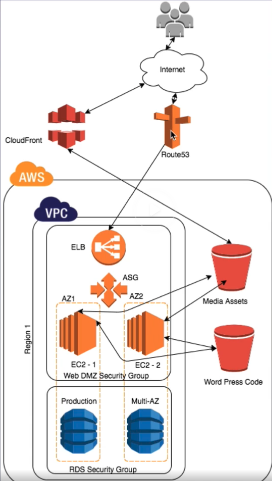

# HA Wordpress Lab

## Lab objectives

Create a Fault tolerant Lab for Wordpress server

Network Diagram

This labs will use most of the resources used along the other labs. Two S3 buckets will hold the media and code for WordPress. 

CloudFront will point to the S3 Media bucket to provide content distribution, and the S3 code will be copied the php code to each Intance at boot time (TODO Migrate to code repo)

The lab will use Route53 to modify the domain entries but you can skip this spe and use de ELB FQDN as main entry point.

The instances are base in a already existent AMI created in the AMI Lab. Is based in a word press installation with apache prepared to process .htaccess rewrites, which will be filed in this lab after the cloud Front creation.

## Lab takeouts

* Design for failure

## References & good readings
* [The Netflix Simian Army](https://netflixtechblog.com/the-netflix-simian-army-16e57fbab116)
